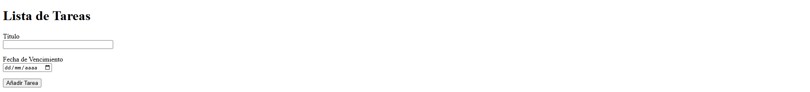
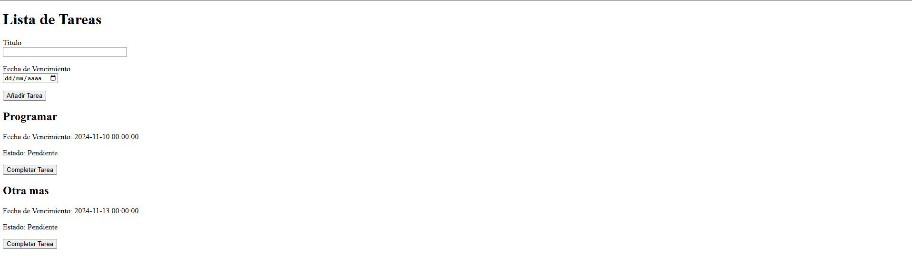
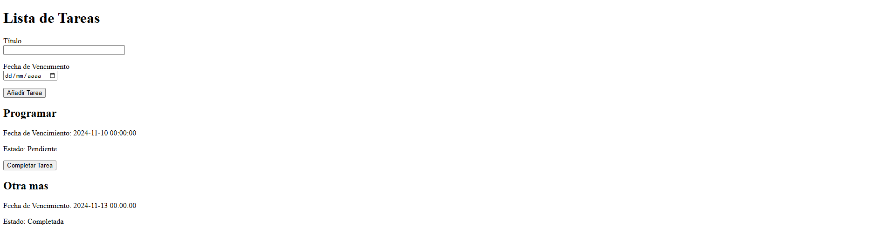

# Task Manager Emiliano García Cordero (20211779) y Gabirel Stoyko Martinez García (20211808)

A continuación se muestra un escenario MVC (Modelo-Vista-Controlador) de nivel intermedio que utiliza .NET 8 con código intencionalmente problemático y objetivos para identificar y corregir problemas en cada componente. Este ejemplo destaca las malas prácticas de código que a menudo se encuentran en aplicaciones del mundo real, especialmente cuando la escalabilidad, la mantenibilidad y la legibilidad se ven comprometidas debido a un mal diseño.

### Escenario: Sistema de gestión de tareas
Nuestro **Sistema de gestión de tareas** ficticio es una aplicación basada en web que permite a los usuarios crear, actualizar y ver tareas. La estructura MVC tiene los siguientes problemas repartidos en cada capa:

#### Objetivos del código a abordar
| Componente           | Descripción del problema                                                                                                                       | Objetivo a Resolver                                                                                                                                                     |
|----------------------|-------------------------------------------------------------------------------------------------------------------------------------------------|--------------------------------------------------------------------------------------------------------------------------------------------------------------------------|
| **Modelo**           | El modelo "Tarea" tiene una lógica empresarial para calcular las fechas de vencimiento directamente dentro del propio modelo. Esta lógica está dispersa, lo que dificulta su mantenimiento. | Aplique el **Principio de responsabilidad única** trasladando la lógica empresarial a una capa de servicio. Considere usar **Patrón de repositorio** para administrar el acceso a los datos por separado. |
| **Vista**            | La vista contiene código C# en línea para cálculos comerciales (por ejemplo, estado vencido). Esta lógica no debería estar en la vista ya que complica la separación de MVC. | Mueva la lógica empresarial al **Controlador** o **ViewModel** para mejorar la separación de preocupaciones y la legibilidad.                                             |
| **Controlador**      | El `TaskController` tiene grandes métodos para el manejo de tareas, incluidas múltiples responsabilidades como validación, manejo de bases de datos y manipulación de datos en una sola acción. | Utilice técnicas de **Método Refactor** y **Extract Class** para reducir el tamaño del método, aislando las responsabilidades de validación y manipulación de datos. Implemente **Capa de servicio** para manejar la lógica empresarial. |
| **Enrutamiento**     | Las URL y rutas codificadas en los controladores hacen que la navegación y el manejo de enlaces sean rígidos, lo que aumenta la posibilidad de errores. | Utilice **Enrutamiento de atributos** para obtener flexibilidad y configuración de ruta centralizada. Utilice **ayudantes de URL** para la generación de URL dinámicas.   |
| **Manejo de errores** | Las excepciones se detectan pero se ignoran, sin registro ni respuesta significativa para el usuario, lo que genera fallas silenciosas.          | Implemente una **Estrategia de registro** y cree un **Mecanismo de manejo de errores** sólido que informe a los usuarios sobre los problemas mientras registra detalles para la depuración. |
| **Acceso a la base de datos** | Las llamadas directas a la base de datos están entrelazadas con la lógica del controlador, lo que dificulta la prueba del código y reduce la modularidad. | Refactorice para utilizar **Patrones de repositorio y unidad de trabajo** para una mejor separación de la lógica de la base de datos y facilitar las pruebas.           |
| **Dependencias**     | El controlador crea instancias directas de dependencias como el contexto de la base de datos, lo que genera un acoplamiento estrecho y dificulta las pruebas unitarias. | Implemente **Inyección de dependencia (DI)** para mejorar la capacidad de prueba y la modularidad. Configure DI en `Startup.cs` para una gestión de dependencias coherente. |
| **Validación**       | No hay validación del lado del servidor para los datos de la tarea; se basa únicamente en comprobaciones iniciales, que pueden omitirse.        | Introduzca **Atributos de validación del modelo** en el modelo "Tarea" y valídelos en el controlador. Considere una biblioteca **Fluent Validation** para escenarios de validación más complejos. |
| **Código asincrónico** | El bloqueo de llamadas síncronas a bases de datos provoca cuellos de botella en el rendimiento del controlador.                               | Utilice el patrón **async/await** para llamadas a bases de datos y otras operaciones de E/S para mejorar la escalabilidad y la capacidad de respuesta.                  |
| **Duplicación de código** | Código duplicado para administrar listas de tareas entre controladores (por ejemplo, recuperar tareas vencidas frente a tareas completadas). | Aplique **Método de plantilla** o **Patrón de estrategia** para encapsular lógica diferente, permitiendo que el código sea más reutilizable.                             |


### Proceso de pensamiento:
En este ejercicio, el estudiante trabajará en cada problema y refactorizará o rediseñará partes de la aplicación utilizando patrones y principios apropiados. El uso de patrones de diseño como **Repositorio, Unidad de trabajo, Inyección de dependencia** y **Método de plantilla** hará que el código base sea más manejable y se alineará con las mejores prácticas para la arquitectura MVC en aplicaciones .NET.

---

### Código Malo: Sistema de Gestión de Tareas en Python (Flask)

#### Estructura del Proyecto
Supongamos una estructura básica de un proyecto en Flask con MVC, donde el modelo, vista y controlador están mal organizados y tienen problemas comunes de código.

#### Model (`models.py`)
```python
from datetime import datetime

class Task:
    def __init__(self, title, due_date):
        self.title = title
        self.due_date = due_date
        self.completed = False
    
    def mark_completed(self):
        self.completed = True
    
    def is_overdue(self):
        # Lógica de negocio en el modelo, no debería estar aquí
        return datetime.now() > self.due_date
```

#### Vista (`templates/task_view.html`)
```html
<!DOCTYPE html>
<html>
<head><title>Task List</title></head>
<body>
<h1>Task List</h1>

    <div>
        <h2>{{ task.title }}</h2>
        <p>Due Date: {{ task.due_date }}</p>
        <p>Status:  Completed  
             Overdue  Pending  
        </p>
    </div>

</body>
</html>
```

#### Controlador (`controllers.py`)
```python
from flask import Flask, render_template, request, redirect
from datetime import datetime
from models import Task

app = Flask(__name__)
tasks = []  # Almacenando datos en lista global

@app.route('/tasks', methods=['GET', 'POST'])
def task_list():
    if request.method == 'POST':
        title = request.form.get('title')
        due_date = datetime.strptime(request.form.get('due_date'), '%Y-%m-%d')
        
        # Validación básica en el controlador
        if not title or not due_date:
            return "Título y fecha de vencimiento son requeridos", 400
        
        # Crear y añadir la tarea
        task = Task(title, due_date)
        tasks.append(task)
        return redirect('/tasks')

    # Cálculos en la vista (esto debería estar en la lógica de negocio o en el modelo)
    overdue_tasks = [task for task in tasks if task.is_overdue() and not task.completed]
    return render_template('task_view.html', tasks=tasks, overdue_tasks=overdue_tasks, now=datetime.now())

@app.route('/tasks/complete/<int:task_id>', methods=['POST'])
def complete_task(task_id):
    try:
        tasks[task_id].mark_completed()
    except IndexError:
        return "Tarea no encontrada", 404
    return redirect('/tasks')
```


# Proyecto una vez refactorizado

# Imagenes del Proyecto
### Pantalla inicial


### Pantalla con tareas


### Pantalla con tarea terminada

